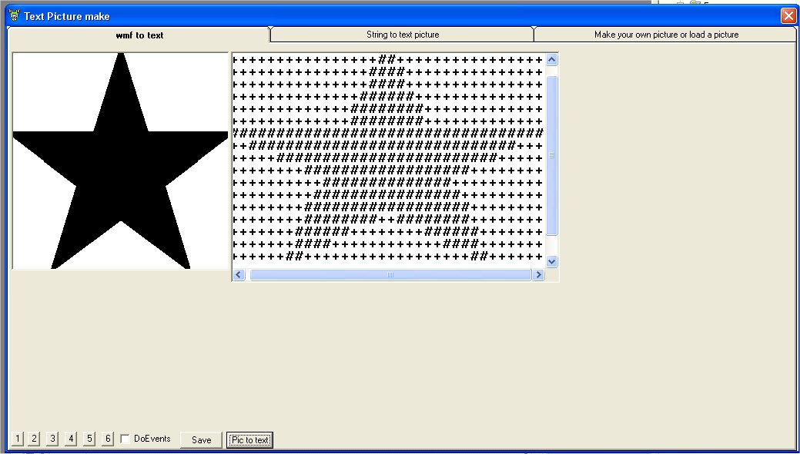



## text picture maker 2

### Description

this is an updated version of my last program... now u can make ur own draw picture or simply load an picture. I use 2 color wmf format.

its really sweet!!! as useral plz vote and leave comments =)
 
### More Info
 

             |
---                |---
**Submitted On**   |2002-06-18 18:10:26
**By**             |[Jonathan Rossing](https://github.com/Planet-Source-Code/PSCIndex/blob/master/ByAuthor/jonathan-rossing.md)
**Level**          |Intermediate
**User Rating**    |4.7 (28 globes from 6 users)
**Compatibility**  |VB 6\.0
**Category**       |[Graphics](https://github.com/Planet-Source-Code/PSCIndex/blob/master/ByCategory/graphics__1-46.md)
**World**          |[Visual Basic](https://github.com/Planet-Source-Code/PSCIndex/blob/master/ByWorld/visual-basic.md)
**Archive File**   |[text\_pictu14853910222002\.zip](https://github.com/Planet-Source-Code/jonathan-rossing-text-picture-maker-2__1-40054/archive/master.zip)

